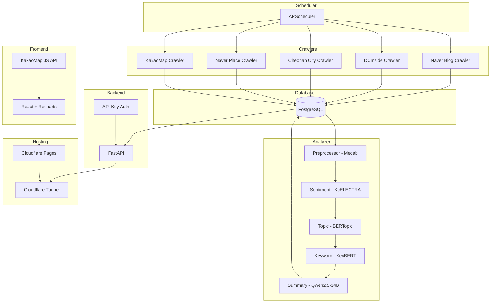
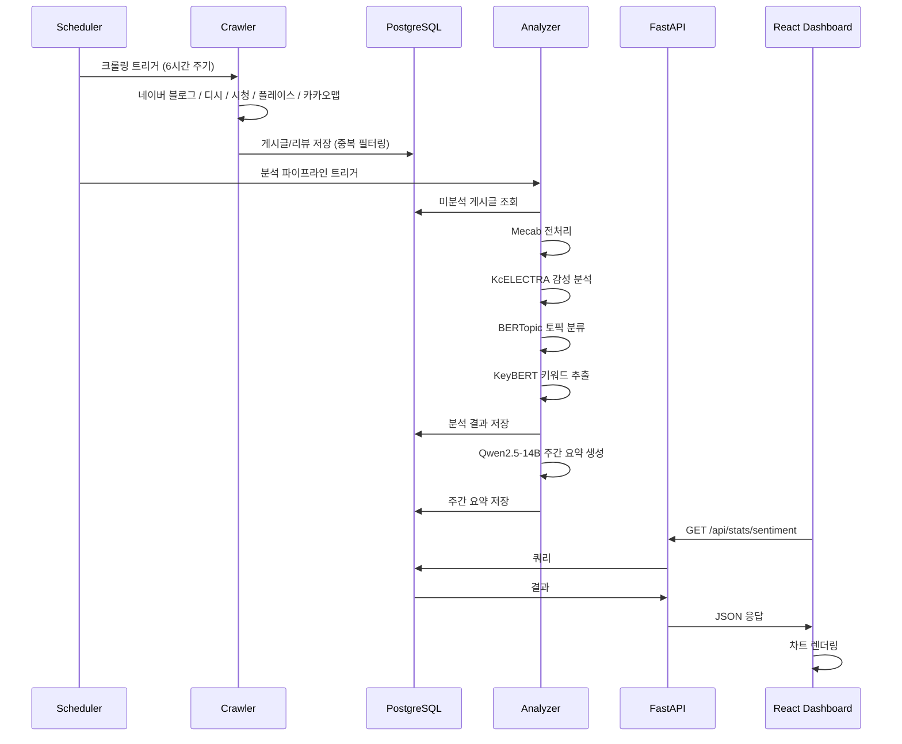

# System Design Document

## 1. Architecture Overview



## 2. Sequence Diagram: Crawling → Analysis → Dashboard



## 3. Class Diagram (DDD Layers)

```mermaid
classDiagram
    %% Domain Layer
    class Post {
        +int id
        +str source
        +str source_id
        +str title
        +str content
        +str author
        +datetime published_at
        +datetime collected_at
    }

    class Analysis {
        +int id
        +int post_id
        +str sentiment
        +float sentiment_score
        +str topic
        +list~str~ keywords
        +datetime analyzed_at
    }

    class Place {
        +int id
        +str name
        +str category
        +str address
        +float rating_naver
        +float rating_kakao
        +float latitude
        +float longitude
    }

    class PlaceReview {
        +int id
        +int place_id
        +str source
        +str review_text
        +str sentiment
        +float sentiment_score
        +list~str~ keywords
    }

    class WeeklySummary {
        +int id
        +date week_start
        +date week_end
        +str summary
        +list~str~ top_topics
        +int total_posts
        +dict sentiment_ratio
    }

    Post "1" --> "*" Analysis
    Place "1" --> "*" PlaceReview

    %% Application Layer - Crawlers
    class BaseCrawler {
        <<abstract>>
        +crawl() list~dict~
        +save(data) void
        +filter_duplicates(data) list~dict~
    }

    class NaverBlogCrawler {
        +crawl() list~dict~
    }

    class DCInsideCrawler {
        +crawl() list~dict~
    }

    class CheonanCityCrawler {
        +crawl() list~dict~
    }

    class NaverPlaceCrawler {
        +crawl() list~dict~
    }

    class KakaoMapCrawler {
        +crawl() list~dict~
    }

    BaseCrawler <|-- NaverBlogCrawler
    BaseCrawler <|-- DCInsideCrawler
    BaseCrawler <|-- CheonanCityCrawler
    BaseCrawler <|-- NaverPlaceCrawler
    BaseCrawler <|-- KakaoMapCrawler

    %% Application Layer - Analyzers
    class BaseAnalyzer {
        <<abstract>>
        +analyze(text) dict
    }

    class Preprocessor {
        +clean(text) str
        +tokenize(text) list~str~
    }

    class SentimentAnalyzer {
        +analyze(text) dict
    }

    class TopicModeler {
        +fit(documents) void
        +predict(text) str
    }

    class KeywordExtractor {
        +extract(text) list~str~
    }

    class Summarizer {
        +summarize(texts) str
    }

    BaseAnalyzer <|-- SentimentAnalyzer
    BaseAnalyzer <|-- TopicModeler
    BaseAnalyzer <|-- KeywordExtractor
    BaseAnalyzer <|-- Summarizer

    %% Infrastructure Layer
    class DatabaseRepository {
        +save_posts(posts) void
        +get_unanalyzed_posts() list~Post~
        +save_analysis(analysis) void
        +get_stats() dict
    }

    class CrawlScheduler {
        +start() void
        +stop() void
        +run_pipeline() void
    }

    DatabaseRepository --> Post
    DatabaseRepository --> Analysis
    DatabaseRepository --> Place
    DatabaseRepository --> PlaceReview
    CrawlScheduler --> BaseCrawler
    CrawlScheduler --> BaseAnalyzer
```



## 4. DDD Layer Structure

```
software_engineering/
├── crawler/                    # Application Layer - Data Collection
│   ├── base.py                # BaseCrawler 추상 클래스
│   ├── naver_blog.py
│   ├── dcinside.py
│   ├── cheonan_city.py
│   ├── naver_place.py
│   ├── kakao_map.py
│   └── scheduler.py          # CrawlScheduler
│
├── analyzer/                   # Application Layer - AI Analysis
│   ├── preprocessor.py        # 텍스트 전처리 (Mecab)
│   ├── sentiment.py           # 감성 분석 (KcELECTRA)
│   ├── topic.py               # 토픽 모델링 (BERTopic)
│   ├── keyword.py             # 키워드 추출 (KeyBERT)
│   ├── summarizer.py          # 요약 (Qwen2.5-14B)
│   └── pipeline.py            # 분석 파이프라인 오케스트레이터
│
├── backend/                    # Presentation + Infrastructure Layer
│   ├── main.py                # FastAPI 앱 진입점
│   ├── config.py              # 환경 설정 (.env 로드)
│   ├── models/                # Domain Layer - ORM 모델
│   │   ├── post.py
│   │   ├── analysis.py
│   │   ├── place.py
│   │   └── weekly_summary.py
│   └── routes/                # Presentation Layer - API 엔드포인트
│       ├── opinion.py         # /api/posts, /api/stats/*, /api/topics, ...
│       ├── places.py          # /api/places, /api/places/ranking, ...
│       └── pipeline.py        # /api/pipeline/run
│
├── frontend/                   # Presentation Layer - UI
│   └── src/
│       ├── components/
│       │   ├── charts/        # 차트 컴포넌트
│       │   ├── map/           # 지도 컴포넌트
│       │   └── common/        # 공통 UI 컴포넌트
│       ├── pages/
│       │   ├── OpinionPage.jsx
│       │   └── PlacesPage.jsx
│       └── api/               # API 호출 모듈
│
├── db/                         # Infrastructure Layer
│   └── init.sql               # DB 스키마
│
└── tests/                      # 테스트
    ├── test_crawlers/
    ├── test_analyzers/
    └── test_api/
```

## 5. Technology Decisions

| Decision | Choice | Rationale |
|----------|--------|-----------|
| Backend Framework | FastAPI | 비동기 지원, 자동 OpenAPI 문서, 타입 힌트 호환 |
| Frontend Framework | React + Recharts | 차트 라이브러리 풍부, 컴포넌트 기반 |
| Database | PostgreSQL | JSONB 지원, 배열 타입, 전문 검색 |
| Sentiment Model | KcELECTRA-base | 한국어 특화, 가벼움 (~1GB), 높은 성능 |
| Topic Model | BERTopic | 비지도 학습, 동적 토픽 수 결정 |
| Summary Model | Qwen2.5-14B Q4 | 한국어 우수, M5 Max에서 쾌적 실행 |
| Hosting | Cloudflare | 무료, Tunnel로 로컬 서버 외부 노출 |
| Scheduler | APScheduler | 파이썬 내장, cron 표현식 지원 |
| Pipeline API Auth | API Key (X-API-Key header) | 학교 프로젝트에 적합한 간단한 인증 |
